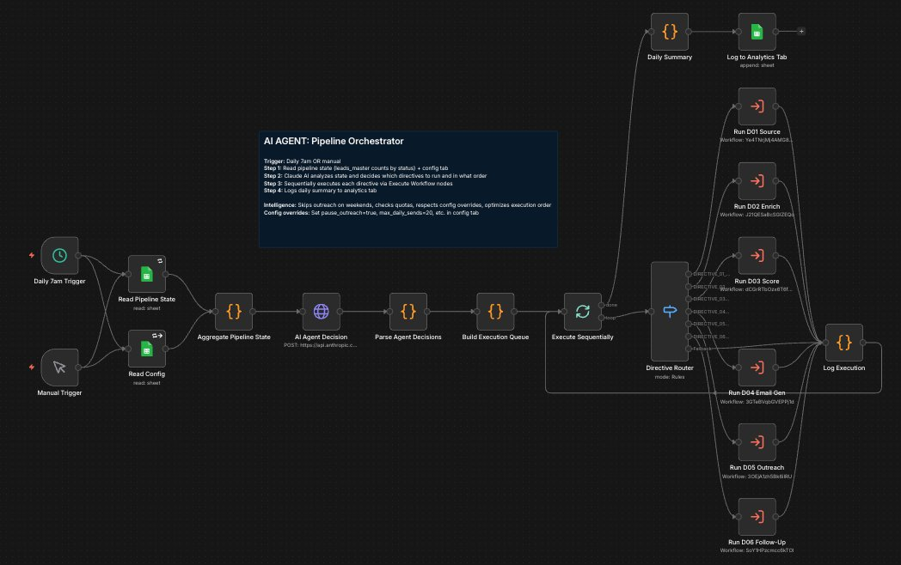

# AI BDR Agent

An autonomous AI-powered Business Development Representative that discovers leads, enriches contact data, scores opportunities, generates personalized cold emails, sends multi-touch follow-up sequences, and tracks engagement. Built entirely with n8n workflow automation, Claude AI, and Google Sheets.



## What It Does

This system replaces the repetitive daily work of a BDR. It runs autonomously on a schedule, executing a 7-stage pipeline every weekday morning:

1. **Lead Discovery** -- Scrapes business listing platforms to find new prospects matching your ICP criteria (industry, location, tech stack signals)
2. **Contact Enrichment** -- Discovers owner/manager email addresses using multi-source enrichment (Hunter.io, web scraping, social profiles)
3. **Lead Scoring** -- AI-powered scoring across four dimensions: delivery signals, business quality, contact completeness, and tech stack fit
4. **Email Generation** -- Claude AI writes hyper-personalized cold emails using business name, cuisine type, review count, rating, and location context
5. **Email Outreach** -- Sends personalized emails in daily batches with proper send tracking and Gmail message ID capture for threading
6. **Follow-Up Sequences** -- 3-touch automated follow-up sequence (value insight, resource/calculator, breakup) threaded into the original email conversation
7. **Open Tracking** -- Custom webhook-based pixel tracking that logs every email open with timestamp and running count

## Architecture

The system is orchestrated by an AI Agent that reads pipeline state, decides which directives to execute, and runs them sequentially:

```
Orchestrator (Daily 9:32 AM)
  |
  |-- D01: Lead Discovery        --> New leads into Google Sheet
  |-- D02: Enrichment Pipeline   --> Contact emails discovered
  |-- D03: Lead Scoring          --> AI scores each lead 0-100
  |-- D04: Email Generation      --> Claude writes personalized emails
  |-- D05: Email Outreach        --> Sends batch of 50/day (weekdays only)
  |
Follow-Up Engine (Daily 10:17 AM)
  |-- D06: Follow-Up Sequences   --> 3 follow-ups, 3 days apart, threaded
  |
Always On
  |-- Email Open Tracker         --> Webhook pixel tracks opens
```

## Key Features

**AI-Personalized Outreach**
- Every email references the prospect's business name, review count, rating, and location
- Cuisine-specific pain point scenarios (15 categories with fallback)
- Tier-based ROI claims calibrated to business type (coffee shop vs steakhouse vs pizza)

**Intelligent Follow-Up Sequences**
- Follow-up #1: Pain point insight with competitor loss angle
- Follow-up #2: Value-add resource (ROI calculator link)
- Follow-up #3: Clean 2-sentence breakup
- All follow-ups thread into the original Gmail conversation using RFC 2822 In-Reply-To headers

**Production Safeguards**
- `pause_outreach` config flag to instantly stop all sends
- Weekday-only sending (restaurant owners are busy on weekends)
- Batch size limits to avoid spam triggers
- Empty item handling to prevent pipeline failures
- Continue-on-error for individual send failures

**Email Open Tracking**
- Custom 1x1 transparent pixel embedded in every email
- Webhook logs opens to Google Sheet with timestamp
- Running open count per lead (multiple opens = high interest signal)
- Cache-busting to prevent false negatives

**Gmail Threading**
- Captures Gmail message ID and thread ID on initial send
- Follow-ups use Gmail API with raw RFC 2822 messages
- Fetches original Message-ID header for proper In-Reply-To threading
- Follow-ups appear in the same conversation, not as new emails

## Tech Stack

- **n8n** -- Workflow automation platform (self-hosted on DigitalOcean)
- **Claude AI (Anthropic)** -- Email generation, lead scoring, orchestrator decisions
- **Google Sheets** -- Lead database, config, analytics
- **Gmail API** -- Email sending with thread support
- **Hunter.io** -- Email discovery and verification
- **Serper API** -- Google search for enrichment
- **Caddy** -- Reverse proxy with automatic SSL
- **Cloudflare** -- DNS management

## Workflows

| File | Description | Nodes |
|------|-------------|-------|
| `d01-lead-discovery.json` | Scrapes business platforms for new leads | 26 |
| `d02-enrichment-pipeline.json` | Multi-source email discovery | 18 |
| `d03-lead-scoring.json` | AI-powered lead scoring (0-100) | 10 |
| `d04-email-generation.json` | Claude writes personalized cold emails | 12 |
| `d05-email-outreach.json` | Batch email sending with tracking | 11 |
| `d06-follow-up-sequences.json` | Threaded 3-touch follow-up engine | 17 |
| `orchestrator.json` | AI agent that coordinates the pipeline | 20 |
| `email-open-tracker.json` | Webhook pixel for open tracking | 8 |

## Setup

### Prerequisites

- Self-hosted n8n instance
- Google Sheets OAuth2 credentials
- Gmail OAuth2 credentials
- Anthropic API key
- Hunter.io API key
- Serper API key

### Installation

1. Import each workflow JSON into your n8n instance
2. Configure credentials (search for `YOUR_CREDENTIAL_ID` placeholders)
3. Create a Google Sheet with a `leads_master` tab and a `config` tab
4. Set `pause_outreach` to `TRUE` in the config tab
5. Activate all workflows
6. Set `pause_outreach` to `FALSE` when ready to go live

### Configuration

The `config` tab in your Google Sheet controls runtime behavior:

| Key | Values | Description |
|-----|--------|-------------|
| `pause_outreach` | TRUE/FALSE | Emergency stop for all email sends |
| `max_daily_sends` | Number | Override batch size |

### Google Sheet Schema

The `leads_master` tab needs these columns (auto-created on first run):

```
lead_id, business_name, address, city, state, phone, website,
cuisine_type, google_rating, google_review_count, contact_name,
contact_email, score, status, email_subject, email_body,
email_sent_at, last_sent_date, send_count, gmail_message_id,
gmail_thread_id, followup_1_sent, followup_2_sent, breakup_sent,
email_opened_at, email_open_count
```

## How the Follow-Up Engine Works

The follow-up system uses cuisine-specific scenario seeds to generate relevant pain points:

```
Coffee/cafe/bakery  --> Morning rush, catering calls, baristas on the bar
Pizza               --> Friday dinner rush, phone ringing, delivery orders lost
Chinese/Thai/Asian  --> Lunch rush takeout, large family orders
Italian             --> Private dining bookings, corporate dinner inquiries
American/grill      --> Happy hour overflow, catering for office events
```

Each follow-up email is threaded into the original conversation by:
1. Fetching the original message's RFC 2822 Message-ID header from Gmail API
2. Setting `In-Reply-To` and `References` headers in the raw email
3. Including the `threadId` in the Gmail API send payload

## License

MIT

## Author

Built by [Mike Paulus](https://github.com/mikegrowsgreens) as a production RevOps automation system.
